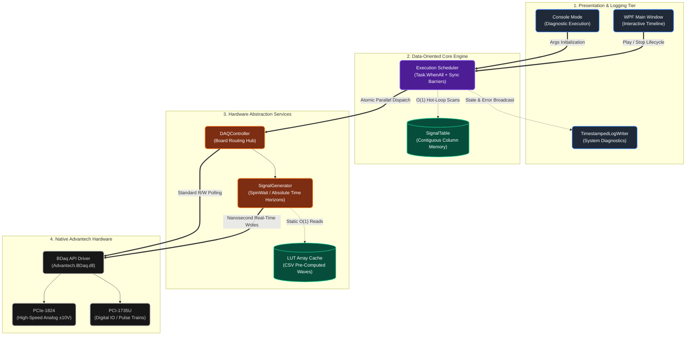

# LAMP DAQ Control v0.8 (Data-Oriented Edition)

Controlador Top-Tier y Plataforma de Ejecución Real-Time para tarjetas de adquisición de datos (DAQ) **Advantech PCIe-1824** y **PCI-1735U**. Diseñado con una interfaz visual WPF moderna y un motor de ejecución de señales **Data-Oriented (DO)** de latencia cero, ideal para aplicaciones científicas e industriales de grado estricto.

## 🎯 Objetivo del Sistema

Proveer una solución centralizada de alto rendimiento que permita el pilotaje preciso, la sincronización microsegundo y la generación paralela de secuencias de control analógicas y digitales masivas, abstrayendo las complejidades del hardware Advantech DAQNavi bajo una UX amigable tipo "Línea de Tiempo" (Timeline).

## 🚀 Características Principales y Capacidades

### 1. 🆕 Data-Oriented Execution Engine (DOD)
La versión 0.8 abandonó la antigua arquitectura de objetos instanciados para adoptar un núcleo **Cache-Friendly** y **Column-Oriented**:
- **Zero Cumulative Error**: Uso de Time Horizons absolutos atados a ticks de procesador (QPC) que previenen la deriva temporal matemática observada habitualmente en el Kernel de Windows.
- **Micro-Sleeps Híbridos**: Algoritmo `HighPrecisionWaitAsync` que intercala inteligentemente `Task.Delay` y `SpinWait` bloqueando el cese al SO si los tiempos son <20ms para alcanzar precisión Atómica.
- **Ejecución Totalmente Paralela (Task.WhenAll)**: Múltiples Waveforms, Rampas y Trenes de Pulso se despachan y sincronizan de forma paralela usando `Barrier` para levantar decenas de transistores en la DAQ con diferencias de fase nulas.

### 2. Controladores de Hardware Potenciados
#### Advantech PCIe-1824 (High-Density Analog Output)
- **Generación Vectorizada de Waveforms**: Utiliza Tablas de Búsqueda (LUTs CSV) en caché para renderizar ondas sinodales sin calcular matemáticas trigonométricas en caliente.
- Salidas escalables DC y Rampas Analógicas suaves.
- Capacidad operativa asíncrona por canal independiente (Voltage range: ±10V).
- Cero Jittering (retardo) perceptivo entre reinicios de secuencias (Looping).

#### Advantech PCI-1735U (High-Speed Digital I/O)
- 32 canales de Entrada/Salida Digital (Port 0-3 bit-a-bit).
- **Trenes de Pulsos Súper Rápidos (PulseTrain)**: Exactitud absoluta desde 1Hz hasta barreras del Framework y Hardware, ideal para control de steppers, activaciones de láser y triggers TTL.

### 3. Workflow Moderno Visual (WPF Timeline)
- **Editor tipo NLE (Non-Linear Editor)**: Drag & Drop nativo. Permite arrojar eventos, waveforms y estados a canales y organizarlos espacialmente.
- **Zoom Dinámico**: Renderizado inteligente que permite escalar visualmente de segundos a milisegundos y viceversa.
- **Panel de Propiedades en Vivo**: Modificación de Amplitudes, Offset, y Periodos "Live".

### 4. Robustez y Mantenibilidad de Producción
- **Global Exception Logger**: Un inyector global interviene la consola (incluso capturando mensajes legacy del Hardware BDaq) incrustando *timestamps* estandarizados.
- **Auto-Session Cleanup**: Sistema inteligente de registros guardados persistentemente bajo `/logs/` que garantizan auditoría pura después de los tests.

---

## Tipos de Señales Soportadas

| Tipo de Evento | Dominio | Descripción | Ajustes en Vivo |
|----------------|---------|-------------|-----------------|
| **Ramp** | Analógico | Transición suave entre puntos de voltaje | Volts (Start, End), Duration |
| **DC** | Analógico | Sostenimiento constante de tensión | Voltage (0-10V), Duration |
| **Waveform** | Analógico | Inyección Trigonométrica periódica | Frequency (Hz), Amplitude, Offset, Duration |
| **PulseTrain** | Digital | Ráfaga de oscilación binaria continua | Frecuencia alta (Hz), Duty Cycle (%) |
| **Digital Pulse** | Digital | Establece un puerto/bit a Estado Alto o Bajo | True/False, Duration |

---

## 📦 Requisitos y Setup

### Requisitos del Sistema
- **Sistema Operativo**: Windows 10/11 (x86/x64). Windows forzado por drivers y Threading.
- **.NET Framework**: v4.7.2 o superior.
- **Hardware Físico**: Advantech PCIe-1824, Advantech PCI-1735U y cableado BNC/Borneras correspondiente.
- **Software**: Drivers nativos Advantech DAQNavi instalados.

### Compilación Rápida (Recomendado)
Para compilar en la máquina de control empleando MSBuild nativo, ejecutar el script:
```powershell
.\BUILD.cmd
# Ejecuta MSBuild internamente bajo configuración Release
```
> ⚠️ **NO se debe** usar `dotnet build` ya que WPF bajo .NET Framework no es portado en ese CLI.

Al finalizar, el binario caerá en la carpeta `/bin/Release/`.

---

## 🚀 Uso Rápido y Ejecución

La herramienta de control cuenta con archivos Batch de inicio rápido (`.bat`) pre-configurados para ejecutar automáticamente los binarios generados bajo máxima optimización (Release).

Puedes arrancar la interfaz gráfica tipo Timeline usando:
```cmd
.\EJECUTAR_WPF.bat
```
*(Inicia el motor Data-Oriented junto a la interfaz gráfica completa).*

Para activar el **modo diagnóstico** usando consola estricta (útil si requieres interactuar sin las capas de UI o si te conectas vía Terminal/SSH):
```cmd
.\EJECUTAR.bat
```
*(Llama tácitamente al ejecutable usando `-console` flag).*

---

## 🛠️ Arquitectura Técnica Resumida



### Notas sobre el `SignalGenerator` (Corazón de Timming):
Este módulo fue reescrito para pre-cargar estructuras asíncronas de alto rendimiento y manejar Thread Priorities a tope (`ThreadPriority.Highest`). Las fases son forzadas a sincronización de Reloj Real empleando estructuras subyacentes libres de bloqueos pesados como `SpinWait`. El GC (Garbage Collector) se exime casi por completo del loop principal.

---

## Directorio Activo de Documentación
Toda auditoría técnica exhaustiva, diagramas arquitectónicos de transición, y reportes de investigación de "Jitter" se almacenan en la carpeta `/Docs/`. Si necesitas trazar los Fixes referidos a nanosegundos y Oversleep del OS Windows revisa en particular el documento: `DATA_ORIENTED_SYNC_FIX_2026-03-26_153500.md`. 

## Licencia y Soporte
Desarrollado y ajustado para operaciones especializadas Multi-Canal High-Speed. Ante dudas de estabilidad, consulte la carpeta `/logs/` que guardará instantáneas segundo a segundo del buffer.